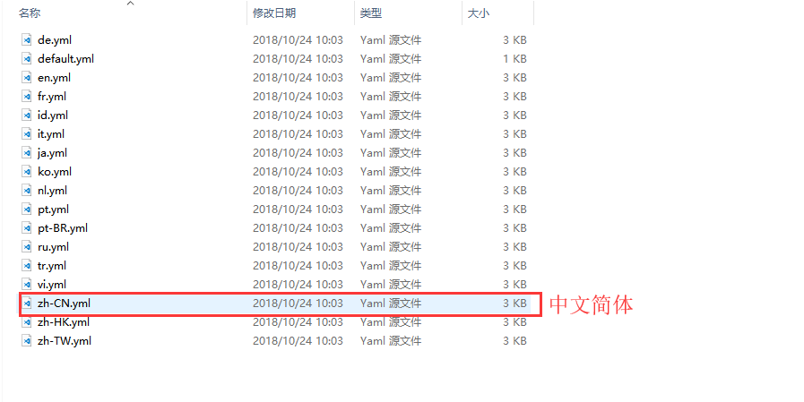
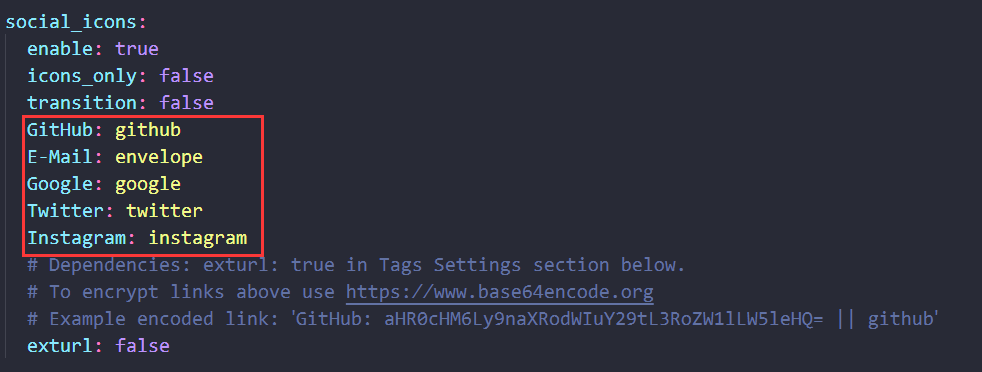

​	在[搭建Hexo博客(搭建+绑定域名+多终端同步)](https://blog.orangehub.cn/2018/10/24/%E6%90%AD%E5%BB%BAhexo%E5%8D%9A%E5%AE%A2/#more)中我们学会了如何搭建一个Hexo博客。这篇，我们主要讲解Hexo的Next主题配置(别问为什么是这个主题，大家都在用....)，不废话了，进入正题。

## 准备工作

### 安装主题

我选择的Next，安装主题仅需一行代码，在你博客的根目录下打开Git Bash 输入：

``` bash
git clone https://github.com/theme-next/hexo-theme-next themes / next
```

以上代码的意思是从[Next主题的GitHub项目](https://github.com/iissnan/hexo-theme-next)中将next下载到当前目录下的themes里面的next文件夹中。

### 启用主题

修改你博客根目录下的配置文件`_config.yml`

``` bash
# Extensions
## Plugins: https://hexo.io/plugins/
## Themes: https://hexo.io/themes/
theme: next ## 原来是 landscape，现在改成 next
```

## 主题设置

### 设置语言

修改你博客根目录下的配置文件`_config.yml`

``` bash
# Site
title: #博客名称
subtitle: #字幕
description: #博客描述
keywords: #关键词
author: #作者
language: #语言
timezone: #时区
```

**注意：再修改language 选项时，后面跟随的值必须是你主题中所包含的值，一定不能自己随便写一个值进去。**

查看路径：你博客根目录\themes\next\languages

PS：这里提一下，你使用`hexo s`预览的时候，你会发现是设置了语言之后界面还是英文，这个时候不要慌，使用`hexo clean`清理下database文件夹以及public文件夹就行了。然后再使用`hexo s` 预览。事实上，这个方法在遇到很多问题的时候都是通用的。

### 设置菜单

​	设置菜单包括三个部分，第一是菜单项（名称和链接），第二是菜单项的显示文本，第三是菜单项对应的图标。

#### 第一步：设置菜单选项

​	进入你博客的next主题的根目录，你会发现在这里也会有一个`_config.yml`文件，真的是巧啊！这个文件主要是针对主题的设置。打开这个文件，找到`menu`

```bash
menu:
  home: / || home #主页
  #about: /about/ || user #关于我
  tags: /tags/ || tags #标签
  #categories: /categories/ || th #分类
  #archives: /archives/ || archive #文章归档
  #schedule: /schedule/ || calendar #时间表
  #sitemap: /sitemap.xml || sitemap #站点地图
  #commonweal: /404/ || heartbeat #404页面

```

根据你的需要，取消掉注释，在博客主页就能够显示相应的菜单名称。

#### 第二步：设置菜单图标

​	不要关闭这个文件，继续找到`menu_setting`（就在menu下面）

``` bsah
# Enable/Disable menu icons / item badges.
menu_settings:
  icons: false #图标
  badges: false #徽章
```

将icons的值改成true，就可以显示菜单图标了。

#### 第三步：设置菜单页面

​	以上两步都完成后，你打开博客，选择其他菜单的时候，会发现根本打不开呢。不要慌，这种情况一般是因为你没有对应的页面，所以打不开呢。我们只需要在我们博客根目录打开 Git Bash并输入：

``` bash

```

在你的网站根目录下面的source文件夹会分别生成tags、categories以及about文件夹。

分别修改这tags和categories文件夹中的`index.md`文件，新增type属性，如下：

``` bsah
---
title: tags
date: 2018-01-04 11:45:41
type: tags
---
```

categories的修改类似。

当你新建一篇博文的时候，增加上tags和categories属性值，就能在tags和categories界面检索到你的文章了。

### 设置侧边栏

同样，在你主题根目录打开`_config.yml`文件。

​	默认情况下，侧栏仅在文章页面（拥有目录列表）时才显示，并放置于右侧位置。 可以通过修改 主题配置文件中的 `sidebar` 字段来控制侧栏的行为。侧栏的设置包括两个部分，其一是侧栏的位置， 其二是侧栏显示的时机。

1. 设置侧栏的位置，修改 `sidebar.position`的值，支持的选项有：

- `left` - 靠左放置
- `right`- 靠右放置

```
sidebar:
  position: left12
```

2. 设置侧栏显示的时机，修改`sidebar.display`的值，支持的选项有：

- `post` - 默认行为，在文章页面（拥有目录列表）时显示
- `always` - 在所有页面中都显示
- `hide` - 在所有页面中都隐藏（可以手动展开）
- `remove` - 完全移除

```
sidebar:
  display: post
```


### 设置头像

在你主题根目录下找到并打卡`_config.yml`文件，接着找到并修改`avatar`字段，设置成头像的链接地址。其中，头像的链接地址可以是：

|     地址     |                              值                              |
| :----------: | :----------------------------------------------------------: |
| 完整的互联网 |            `URI`:`http://example.com/avatar.png`             |
| 站点内的地址 | 将头像放置主题目录下的`source/uploads/`（新建 `uploads` 目录若不存在） 配置为：`avatar: /uploads/avatar.png`或者 放置在 `source/images/ 目录下`, 配置为：`avatar: /images/avatar.png` |


### 设置侧边栏社交链接

侧栏社交链接的修改包含两个部分，第一是链接，第二是链接图标。 两者配置均在主题根目录的`_config.yml`文件中

#### 第一步：设置链接

链接放置在 `social`字段下，一行一个链接。其键值格式是 `显示文本: 链接地址`。

```bash
# Social Links.
# Usage: `Key: permalink || icon`
# Key is the link label showing to end users.
# Value before `||` delimeter is the target permalink.
# Value after `||` delimeter is the name of FontAwesome icon. If icon (with or without delimeter) is not specified, globe icon will be loaded.
#social:
  #GitHub: https://github.com/yourname || github
  #E-Mail: mailto:yourname@gmail.com || envelope
  #Google: https://plus.google.com/yourname || google
  #Twitter: https://twitter.com/yourname || twitter
  #FB Page: https://www.facebook.com/yourname || facebook
  #VK Group: https://vk.com/yourname || vk
  #StackOverflow: https://stackoverflow.com/yourname || stack-overflow
  #YouTube: https://youtube.com/yourname || youtube
  #Instagram: https://www.instagram.com/yourname/ || instagram
  #Skype: skype:yourname?call|chat || skype
```


#### 第二步：设置链接图标

设定链接的图标，对应的字段是 `social_icons`。其键值格式是 匹配键:`Font Awesome`图标名称， 匹配键 与上一步所配置的链接的 显示文本 相同（大小写严格匹配），图标名称 是`Font Awesome`图标的名字（不必带 fa- 前缀）。 `enable` 选项用于控制是否显示图标，你可以设置成 false 来去掉图标。

```bash
social_icons:
  enable: true
  icons_only: false
  transition: false
  GitHub: github
  E-Mail: envelope
  Google: google
  Twitter: twitter
  Instagram: instagram
  # Dependencies: exturl: true in Tags Settings section below.
  # To encrypt links above use https://www.base64encode.org
  # Example encoded link: `GitHub: aHR0cHM6Ly9naXRodWIuY29tL3RoZW1lLW5leHQ= || github`
  exturl: false
```



### 开启打赏功能

付费阅读时代越来越近，特此增加了打赏功能，支持微信打赏和支付宝打赏。 只需要主题配置文件，搜索`Reward`字段

```bash
# Reward
#reward_comment: Donate comment here
wechatpay: #微信收款二维码图片地址
alipay: #支付宝收款二维码图片地址
bitcoin: #比特币收款二维码图片地址
```

### 设置站点建立时间

同一个文件搜索`since`字段，并设置相应的年份


### 订阅微信公众号

​	在每篇文章的末尾显示微信公众号二维码，扫一扫，轻松订阅博客。在微信公众号平台下载您的二维码，并将它存放于博客`source/uploads/`目录下。搜索`wechat_subscriber`

```bash
# Wechat Subscriber
wechat_subscriber:
  enabled: true
  qcode: #二维码图片地址
  description: #描述
```

