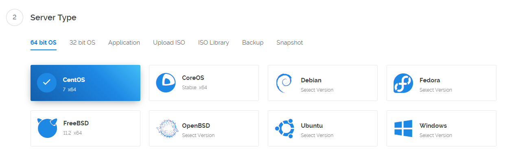
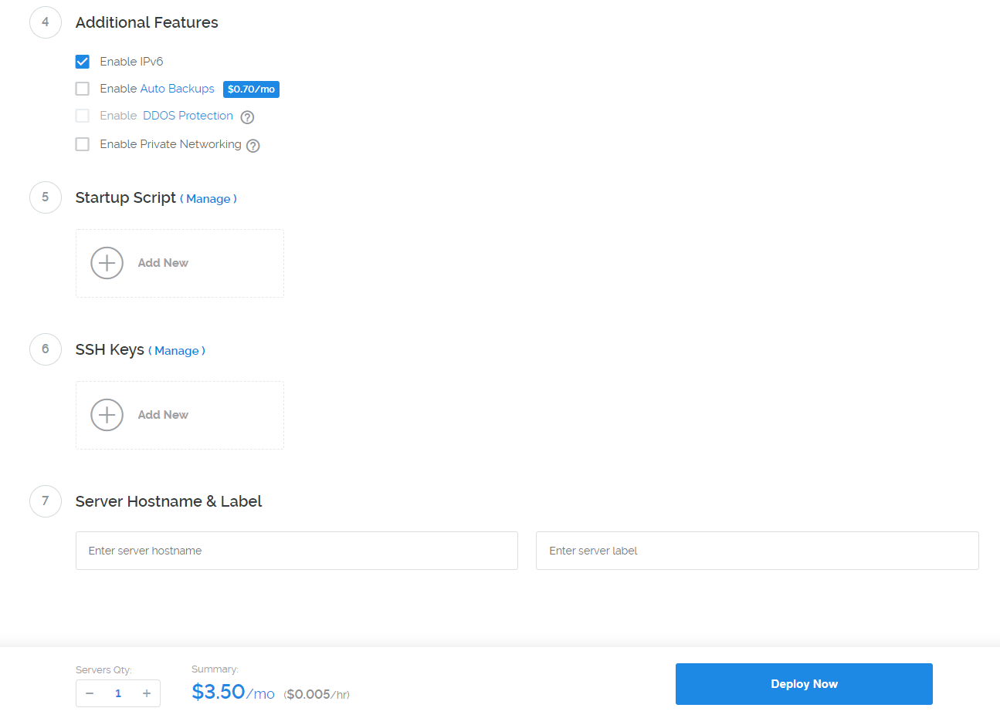
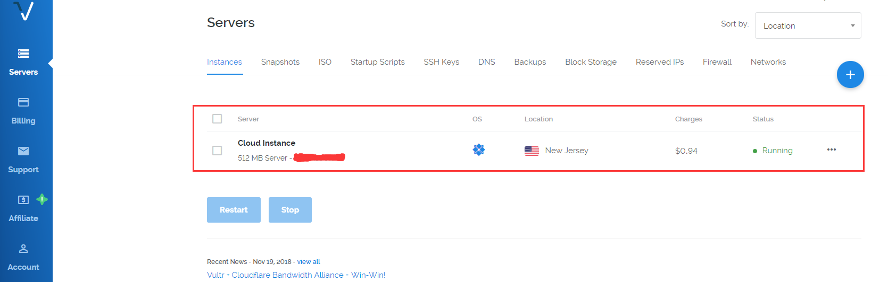
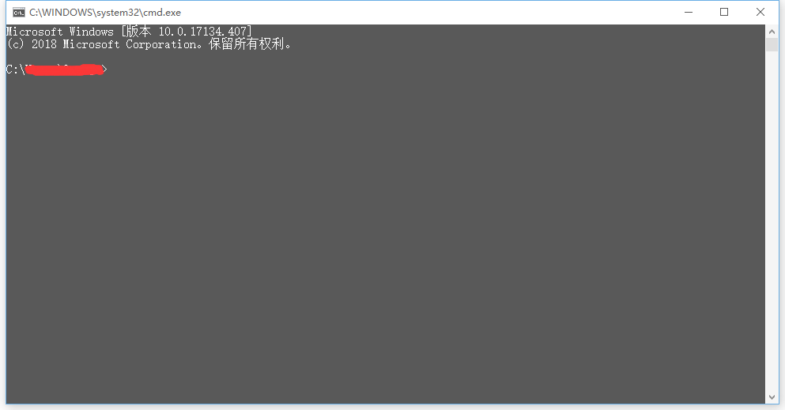
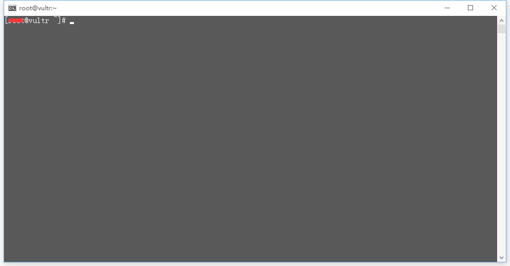

由于工作需要，很多时候我们可能需要用科学上网的方式去查资料。科学上网的途径主要有以下几种：

* 购买VPN

* 免费的VPN

* 搭建vps服务器

  三种方式各有各的优缺点，主要还是看你怎么选择咯~

  通过vpn上网的优点就是操作简单，比较适合不是经常使用科学上网的人，但是也有缺点。缺点就是容易被封，会被限制速度。PS：免费VPN与付费VPN的主要区别在于安全性，也就是说免费的可能会泄露的个人信息。但是！试问谁在网上不是裸奔呢？

  这里我主要讲第三种方式——搭建VPS服务器

# 购买服务器

  这里推荐几个个国外的VPS服务器厂商

  * [Vultr](https://www.vultr.com/?ref=7234693)

  * [Bandwagonhost(搬瓦工)](https://bwh8.net/)

	这两个算是比较不错的vps服务器厂商，因为我购买的时候搬瓦工已经没有了19.9刀一年的服务器了，所以我选择了[Vultr](https://www.vultr.com/?ref=7234693)，支持支付宝和微信付款，还是比较方便的。 

## 注册账号


填写你的e-mail地址和密码，然后创建一个账号，可能会需要你验证邮箱什么的，跟着操作就好咯，这里就不赘述了。

## 激活账号


登陆进去后点击左边菜单栏的Billing 选择 Alipay(支付宝)或者 WeChat Pay(微信)付款10刀才能激活账户，差不多够用两个多月左右(3.5刀/月)，激活完成后点击右上角的进行服务器的购买


## 服务器选择

主要分为3步：选择服务器位置，选择系统，选择配置

### 选择服务器位置


> 理论上：离你越近越好，通常选择tokyo节点

### 选择系统



> 推荐选择 CentOs7

### 选择配置


> 由于2.5刀的配置只有ipv6，我们这里选择3.5刀的配置，这两个配置的区别就是一个没有ipv4一个有ipv4，由于ipv6不稳定，建议选择3.5刀的配置。

### 提交



> 选择好了之后，我们点击下面的 Deploy Now 就OK啦~

至此，服务器就已经购买完成啦，我们回到控制台界面。



这里就是你购买的服务器啦，下面我们开始搭建VPS

# 搭建VPS

点击你的服务器，进入服务器详细页面


> IP Address:你的IP地址
>
> Username：用户名
>
> Password：密码
>
> 小眼睛：查看密码

## 登陆服务器

我们在电脑上(win10)呼出cmd（win+r => 输入cmd => 回车）



打开就是这样的，下面我们通过ssh登入服务器

``` bash
ssh 用户名@ip地址
```

> 用户名和ip地址需要你自己填写

输入完成后需要输入密码

> 密码不会显示出



这样表示已经登录成功了。

