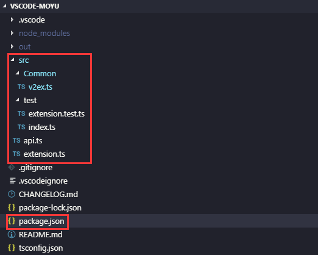
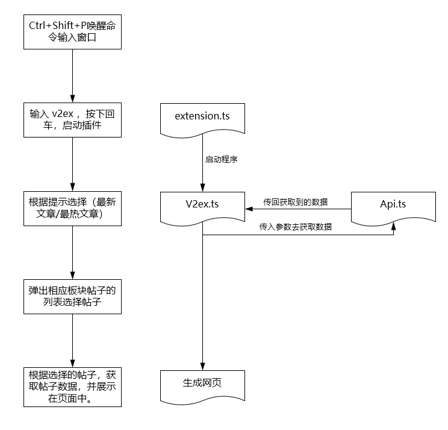

# 写在前面

从本篇文章开始，我将采用我已经完成的项目进行讲解，项目的源码我已传至[GitHub](https://github.com/OrangeEd1t/VSCode-MOYU)欢迎clone。

# 项目介绍

该项目是一个比较简单，适合新手入门的一个项目，项目结构简单不复杂。

## 项目结构

与上篇文章的目录结构大致类似



我们仅需要关注红框标识部分

```
* package.json[文件]:该文件在上篇文章中已提到，此处不再赘述。
* src[文件夹]:我们整个项目的存放目录。
* Common[文件夹]:这里存放的是我们程序实现的主体。
* test[文件夹]:这个文件夹里主要存放的测试需要的文件，可以不用去管它。
* api.ts[文件]:这里存放的是获取数据的程序。
* extension.ts[文件]:该文件在上篇文章中已提到，此处不再赘述。
```

## 项目执行流程



## 项目调试

## 项目发布

