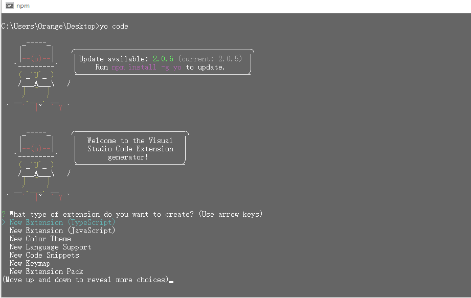
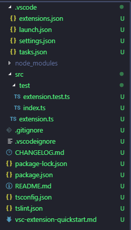
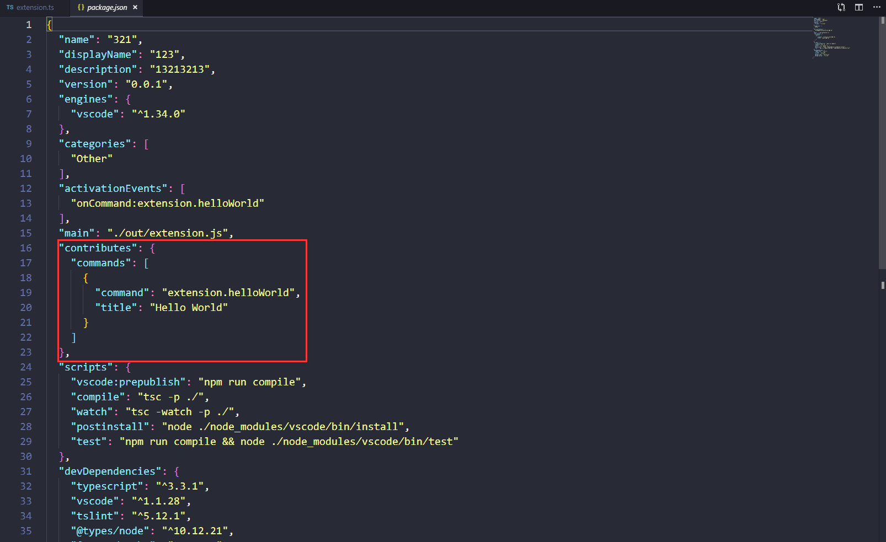
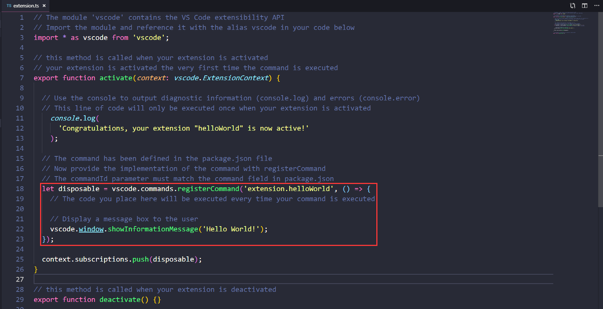

# 写在前面

​		VSCode的插件开发可以使用[微软官方的脚手架](https://github.com/Microsoft/vscode-generator-code)来生成项目结构，这种方式最方便快捷。话不多说，接下来我们就来搭建一个建单的项目框架。

# 项目搭建

## 安装脚手架

打开控制台，键入以下代码：

```
npm install -g yo generator-code
```

## 搭建项目

安装好脚手架之后，在控制台运行以下代码，开始启动生成器：

```
yo code
```



跟着安装提示一步一步的来，最后生成一个项目，项目的大致结构如下：



PS：基本上我们所有的代码都会存在于src这个文件夹的目录下。

## 基本文件解读

### 清单文件(package.json)



​		在上面的截图中，我红框标注的地方就是，整个项目入口的关键位置，下面我们对截图中的部分代码进行一个说明：

	*  `main` 定义了整个插件的主入口；
	*  我们在`contriibutes.commands`里面注册了一个名为`extension.helloWorld`的命令，并在`src/extension.js`中去实现了它（弹出一个`Hello World`的提示）；
	*  但是仅仅这样还不够，命令虽然定义了，但是vscode还不知道啥时候去执行它，还需要在`activationEvents`添加上`onCommand:extension.helloWorld`用来告诉vscode，当用户执行了这个命令操作时去执行前面我们定义的内容；

### 项目入口(extension.ts)



​		这个文件就是程序的入口文件，即上方`package.json`文件中`main`所对应路径的文件。其中，我红框标注的地方为程序的实现部分，这里的大致意思就是，我输入`helloWorld`这个命令，程序会自动在页面右下角弹出一个`Hello World`的提示框。

# 多说两句

该文章中所展示的是一个刚新建完成的项目结构（其实是我项目没写完，到现在都没写完/(ㄒoㄒ)/~~），目的是让小白清楚大致的项目结构。从下篇文章起，我将采用我已经完成的项目结构进行讲解。